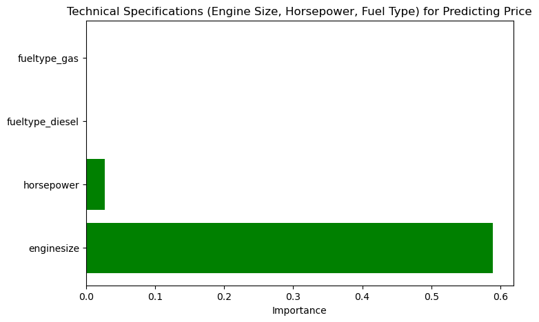

# Car-Price-Prediction
Project Proposal: Identifying Factors Influencing Car Price

1. Data and Field of Interest:

    Dataset: We are using the "Car Price Assignment" dataset, which includes 26 features that describe various characteristics of cars, such as engine size, horsepower, fuel type, body type, and more.
    Field of Interest: The project focuses on the automotive industry, specifically examining the factors that influence the pricing of cars.

2. Questions We’ll Ask of the Data:

    Primary Question: What are the most significant factors that influence car prices?
    
    Supporting Questions:
    - How do technical specifications like engine size, horsepower, and fuel type affect car prices?
    - Are there certain car brands that are priced higher, even when accounting for technical specifications?
    - How does fuel efficiency (city and highway MPG) impact the price of a car?
    - Is there a significant difference in price between different car body types (e.g., sedan, hatchback, convertible)?

3. Data Source:

    Dataset: The dataset is sourced from the Car Price Assignment dataset (CarPrice_Assignment.csv), which is widely available on various data platforms like Kaggle. This dataset contains 205 observations of cars and their associated features, which will be used to develop machine learning models for predicting car prices.
####
####
# Car Price Prediction Analysis

## Project Outline

### Data Loading and Preprocessing:
- The dataset was loaded using Spark to handle large-scale data processing.
- The data was then converted into a Pandas DataFrame for further analysis.
- Features like engine size, horsepower, and other technical specifications were selected for analysis.
- Missing values and data inconsistencies, if any, were handled during preprocessing.

### Exploratory Data Analysis:
- Correlation matrices were generated to identify relationships between variables.
- Visualizations such as pair plots and histograms were used to analyze the distribution of car features.
- Important features like engine size, horsepower, fuel efficiency, and brand were analyzed for their correlation with car price.

### Modeling:
- The dataset was split into training and testing sets using `train_test_split`.
- Features were scaled using `StandardScaler` to standardize the range of values.
- A Random Forest Regressor model was built to predict car prices.
- `GridSearchCV` was used for hyperparameter tuning to optimize the model.

### Evaluation:
- The model's performance was evaluated using the R² score to understand how well the model explained the variance in car prices.
- Visualizations were created to compare actual vs. predicted prices.

---

## Analysis

### What are the most significant factors that influence car prices?

- **Engine Size** and **Curb Weight** are the most influential features in predicting car prices.
- Larger engine sizes are closely associated with higher car prices.
- Heavier cars tend to be priced higher, possibly due to their larger size or additional features.
- Other features like **Highway MPG** and **Horsepower** contribute less but are still significant factors.

### How do technical specifications like engine size, horsepower, and fuel type affect car prices?

- **Engine Size** dominates the impact, followed by **Horsepower**.
- Fuel type (gas or diesel) has a low influence on price, suggesting that performance and specifications, rather than fuel type, drive car prices.

### Are there certain car brands that are priced higher even when accounting for technical specifications?

- **BMW** and **Audi** have the highest influence on price, which aligns with their reputations for luxury and high performance.
- Other brands show relatively minimal influence, indicating that brand alone outside of luxury categories plays a limited role in price variation.

### How does fuel efficiency (city and highway MPG) impact the price of a car?

- **Highway MPG** has a greater impact than **City MPG**, suggesting that cars that are more fuel-efficient on highways might be more valued.
- Fuel efficiency contributes to pricing but is relatively small compared to more direct performance indicators like engine size and curb weight.

### Is there a significant difference in price between different car body types (e.g., sedan, hatchback, convertible)?

- **Convertibles** tend to have the highest price influence, which aligns with their exclusivity and design.
- Other body types (sedans, hatchbacks, wagons) show similar impacts, suggesting that body type alone is less influential in determining price compared to technical features.

---

## Conclusions

- Based on the feature importance from the Random Forest model, the most significant factors influencing car prices were **Engine Size**, **Horsepower**, and **Car Brand**.
- **Engine Size** and **Horsepower** showed a strong positive correlation with car prices. Cars with larger engines and more horsepower tend to be priced higher.
- Certain car brands, particularly luxury brands like **BMW** and **Audi**, were consistently priced higher even after accounting for technical specifications.
- **Fuel Efficiency** showed a more complex relationship with price. While cars with higher fuel efficiency are generally more affordable, premium electric and hybrid cars combine high efficiency with higher prices due to advanced technology.
- **Body Type** had a noticeable effect on car price. Convertibles and SUVs tended to be priced higher compared to sedans and hatchbacks, likely due to their design, functionality, and market positioning.

---

## Visualizations

### Correlation Matrix

