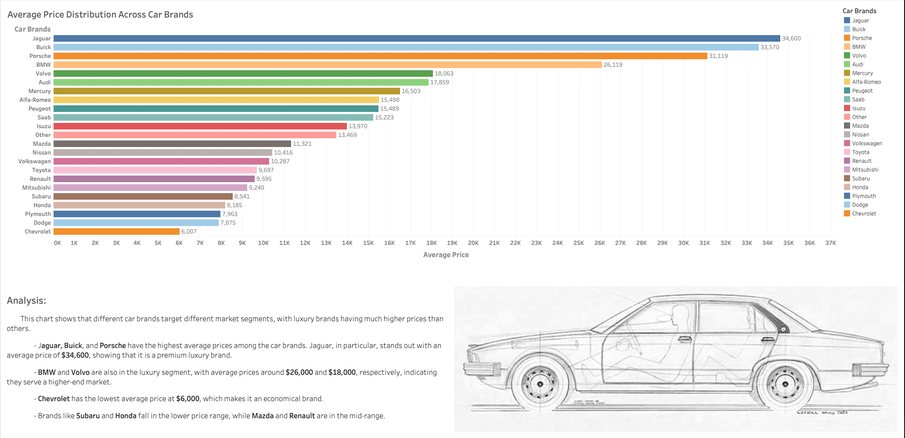
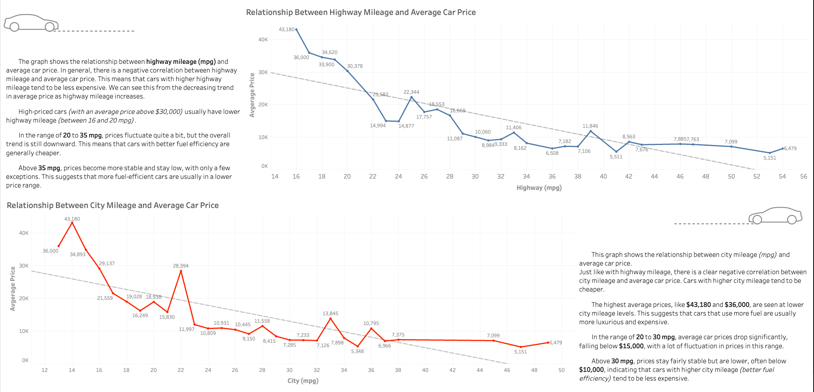
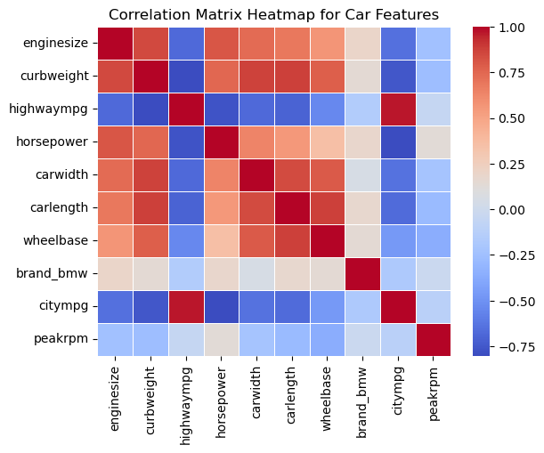

# Car-Price-Prediction 🚗📈  
A machine learning project to identify the key features that influence car prices, using the Car Price Assignment dataset. This project combines data preprocessing, exploratory visual analysis, and predictive modeling to help understand what drives car value.

---

## 🔍 Overview

As car buyers become more data-savvy and the market gets more competitive, being able to predict and understand car prices is more relevant than ever. In this project, we used machine learning—specifically a Random Forest Regressor—to analyze the technical and brand-specific factors that contribute to vehicle pricing.

---

## 📊 Key Insights (Before Modeling)

### Average Price Distribution Across Car Brands
  
Jaguar, Buick, and Porsche have the highest average prices, while Chevrolet ranks among the lowest.

### Diesel vs. Gas Price Comparison by Brand
  
Diesel cars are typically more expensive for brands like Buick and Volvo.

### Car Body Types & Average Price
  
Convertibles and hardtops dominate the luxury segment.

### Mileage vs. Price
  
Fuel-efficient cars tend to be cheaper; there’s a clear negative correlation.

---

## 🧠 Machine Learning Pipeline

### 1. Data Preparation
- Cleaned and preprocessed 205 observations with 26 car-related features.
- Used Spark for scalability, then Pandas for detailed analysis.

### 2. Feature Selection
- Focused on engine size, curb weight, horsepower, fuel efficiency, brand, and body type.

### 3. Model Building
- Used `train_test_split` and `StandardScaler`.
- Trained a `RandomForestRegressor` and tuned with `GridSearchCV`.

### 4. Evaluation
- Achieved an R² score of **0.959**, outperforming the project benchmark of 0.80.

---

## 🔬 Model-Driven Visuals

### Top 10 Influential Features
  
**Engine Size** and **Curb Weight** are the biggest predictors of price.

### Technical Specs Impact
  
Horsepower plays a moderate role; fuel type is less influential.

### Brand Influence
  
Luxury brands like **BMW** and **Audi** drive price, even when controlling for specs.

### Fuel Efficiency
  
Highway MPG matters more than city MPG—but both are secondary to engine size.

### Body Type Comparison
  
Convertibles command premium pricing.

### Correlation Matrix
  
Size-related features (engine size, curb weight) strongly correlate with price and each other.

---

## 📌 Conclusions

- Engine size, curb weight, and horsepower are the top drivers of price.
- Luxury brands matter, especially BMW and Audi.
- Fuel efficiency and body type influence price—but not as much as power and size.

---

## 📈 Tableau Visualization  
View our Tableau dashboard:  
[Car Price Prediction Visualization](https://public.tableau.com/app/profile/sanem.gingery/viz/Car_Price_Tableau/FINAL?publish=yes)

---

## 🧰 Tools & Resources

- [Scikit-Learn: RandomForestRegressor](https://scikit-learn.org/stable/modules/generated/sklearn.ensemble.RandomForestRegressor.html)  
- [GridSearchCV Docs](https://scikit-learn.org/dev/modules/grid_search.html#grid-search)  
- [Tuning Feature Importance](https://www.geeksforgeeks.org/feature-importance-with-random-forests/)  
- [Pandas Correlation Matrix](https://stackoverflow.com/questions/29432629/plot-correlation-matrix-using-pandas)

---

## 💾 Dataset

This project uses the open-source [CarPrice_Assignment.csv] dataset (commonly found on Kaggle). It includes technical and categorical features for 205 cars.

---

## 👥 Team

This was a collaborative team effort as part of the Northwestern Data Science Bootcamp.
