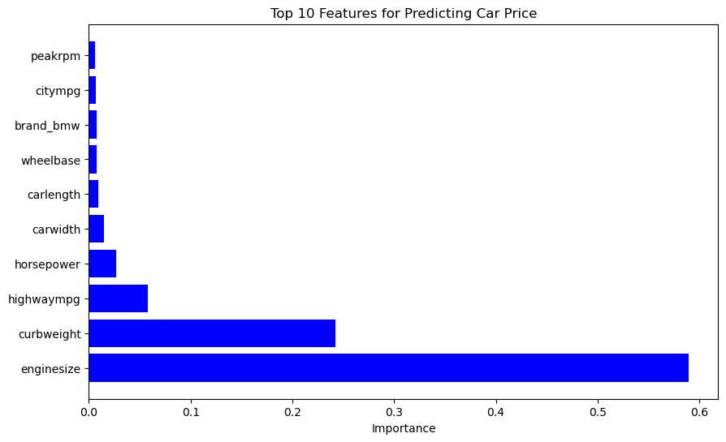
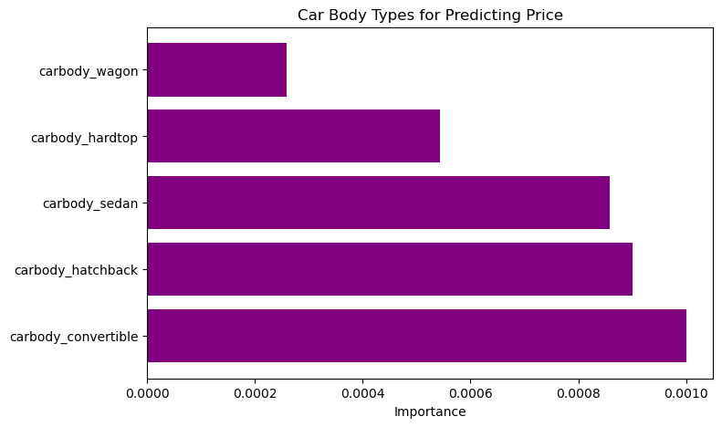

# Car-Price-Prediction
Project Proposal: Identifying Factors Influencing Car Price

1. Data and Field of Interest:

    Dataset: We are using the "Car Price Assignment" dataset, which includes 26 features that describe various characteristics of cars, such as engine size, horsepower, fuel type, body type, and more.
    Field of Interest: The project focuses on the automotive industry, specifically examining the factors that influence the pricing of cars.

2. Questions We’ll Ask of the Data:

    Primary Question: What are the most significant factors that influence car prices?
    
    Supporting Questions:
    - How do technical specifications like engine size, horsepower, and fuel type affect car prices?
    - Are there certain car brands that are priced higher, even when accounting for technical specifications?
    - How does fuel efficiency (city and highway MPG) impact the price of a car?
    - Is there a significant difference in price between different car body types (e.g., sedan, hatchback, convertible)?

3. Data Source:

    Dataset: The dataset is sourced from the Car Price Assignment dataset (CarPrice_Assignment.csv), which is widely available on various data platforms like Kaggle. This dataset contains 205 observations of cars and their associated features, which will be used to develop machine learning models for predicting car prices.
####
####
# Car Price Prediction Analysis

## Project Outline

### Data Loading and Preprocessing:
- The dataset was loaded using Spark to handle large-scale data processing.
- The data was then converted into a Pandas DataFrame for further analysis.
- Features like engine size, horsepower, and other technical specifications were selected for analysis.
- Missing values and data inconsistencies, if any, were handled during preprocessing.

### Exploratory Data Analysis:
- Correlation matrices were generated to identify relationships between variables.
- Charts were used to visualiize the importance of car features in predicting car prices.
- Important features like engine size, horsepower, fuel efficiency, and brand were analyzed for their correlation with car price.

### Modeling:
- The dataset was split into training and testing sets using `train_test_split`.
- Features were scaled using `StandardScaler` to standardize the range of values.
- A Random Forest Regressor model was built to predict car prices.
- `GridSearchCV` was used for hyperparameter tuning to optimize the model.

### Evaluation:
- The model's performance was evaluated using the R² score to understand how well the model explained the variance in car prices.
- The n_estimators factor (n_estimators=1000) in the RandomForestRegressor had the biggest impact on quality of performance by the model.
- Please see code for further insight into optimization.

---

## Analysis

### What are the most significant factors that influence car prices?

- This bar chart highlights the top 10 most influential features in predicting car prices according to their importance values. The largest contributing features are engine size and curb weight, with engine size having the highest influence on car price. Other features like horsepower, highway mpg, and car width contribute less but are still significant.

#### Analysis:
- **Engine size** being the top feature indicates that larger engine sizes are closely associated with higher car prices.
- **Curb weight** also plays a significant role, suggesting that heavier cars tend to be priced higher, possibly due to their larger size or additional features.
- Features like **highway mpg** and **horsepower** have less influence, but they are still contributing factors, which supports the idea that fuel efficiency and power play some role in price variation.
- This visualization helps us understand which features to focus on when optimizing car price prediction models or refining feature selection for price prediction.

### How do technical specifications like engine size, horsepower, and fuel type affect car prices?

- This chart breaks down how specific technical specifications—engine size, horsepower, and fuel types (gas or diesel)—influence car prices. Like the first chart, engine size dominates the impact, followed by horsepower.

#### Analysis:
- **Engine size** again emerges as the strongest predictor of car prices, reinforcing its importance.
- The low influence of **fuel types** suggests that whether a car uses gas or diesel is not a significant factor in determining its price. This might indicate that the price is more affected by the car's performance and specifications rather than its fuel type.
- **Horsepower** plays a smaller role, but its presence indicates that more powerful engines slightly contribute to higher prices.

### Are there certain car brands that are priced higher even when accounting for technical specifications?

- This chart visualizes the impact of different car brands on price, with **BMW** having the highest influence, followed by **Audi**. Other brands have minimal impact in comparison.

#### Analysis:
- **BMW** and **Audi** standing out suggests that cars from these premium brands are associated with higher prices. This is consistent with these brands' reputations for luxury and high performance.
- Most other brands show relatively minimal influence, which could indicate that brand alone, outside of luxury categories, has a limited role in determining car prices compared to other technical specifications.
- This supports the analysis that high-end brands like **BMW** and **Audi** can serve as important features for premium price prediction, but many other brands may not differentiate car prices as significantly.

### How does fuel efficiency (city and highway MPG) impact the price of a car?

- This chart focuses on how fuel efficiency, measured by city mpg and highway mpg, influences car prices. **Highway mpg** has a greater impact than **city mpg**, though neither is a dominant feature.

#### Analysis:
- The higher influence of **highway miles per gallon** over city miles per gallon suggests that for price prediction, cars that are more fuel-efficient on highways might be more valued.
- While fuel efficiency does contribute to pricing, it is relatively small compared to more direct performance indicators like engine size and curb weight. This indicates that while buyers consider fuel efficiency, other specifications hold more weight in determining a car's price.

### Is there a significant difference in price between different car body types (e.g., sedan, hatchback, convertible)?

- This chart shows how different car body types influence car prices. All body types (wagon, convertible, sedan, etc.) have relatively small impacts, with **convertible** showing the highest influence.

#### Analysis:
- The slight dominance of **convertibles** aligns with the perception of convertibles being more expensive due to their design and exclusivity.
- Other body types, such as sedans, hatchbacks, and wagons, show relatively minor importance, indicating that body type alone may not heavily drive price differences except for convertibles.
- This supports the idea that body type, although a factor, might be less influential compared to performance or technical features when predicting car prices.

### Correlation Matrix

- Six of our top ten most important features show strong positive scorrelation with eachother as they all describe the size of the car.
- While it may seem obvious that car width and car height have a strong positive correlation, it's less obvious that horsepower and curb weight would have this correlation.
- Unsurprisingly, the features related to fuel efficiency are heavily correlated with each other and inversely related to all other factors. This tells us that larger cars have worse fuel efficiency and that BMWs tend to be less efficient than their competitors.
- The final two features are brand_bmw and peakrpm. Brand_bmw seems to have little correlation to other features, but the relationship it does have shows that BMWs tend to be larger and less fuel efficient. A similar correlation that includes all of the brands might help people decide which vehicle to purchase. Peakrpm shows negative correlation with every feature aside from horsepower, which makes sense because the bigger the car the lower the rpm.
---

## Conclusions

- Based on the feature importance from the second Random Forest model (model_2), the most significant factors influencing car prices were **Engine Size**, **Curb Weight**, **Highway MPG** and **Horsepower**.
- Certain car brands, particularly luxury brands like **BMW** and **Audi**, showed greater influence on predicting car prices even after accounting for technical specifications.
- **Fuel Efficiency** showed a more complex relationship with price. While cars with higher fuel efficiency are generally more affordable, premium electric and hybrid cars combine high efficiency with higher prices due to advanced technology.
- In terms of **Body Type**, convertibles and hatchbacks tended to have greater influence on price compared to sedans, hardtops and wagons, likely due to their design, functionality, and market positioning.

---

## Tableau Visualization

For an in-depth visualization of the car price data analysis, please refer to the Tableau graphic:
[Car Price Prediction Tableau Visualization](https://public.tableau.com/app/profile/sanem.gingery/viz/Car_Price_Tableau/FINAL?publish=yes)

## Resources

Here are the resources used in this project:

- [RandomForestRegressor Documentation](https://scikit-learn.org/stable/modules/generated/sklearn.ensemble.RandomForestRegressor.html)
- [GridSearchCV Documentation](https://scikit-learn.org/dev/modules/grid_search.html#grid-search)
- [Correlation Matrix Plotting](https://stackoverflow.com/questions/29432629/plot-correlation-matrix-using-pandas)
- [Feature Importance in Random Forests](https://www.geeksforgeeks.org/feature-importance-with-random-forests/)
